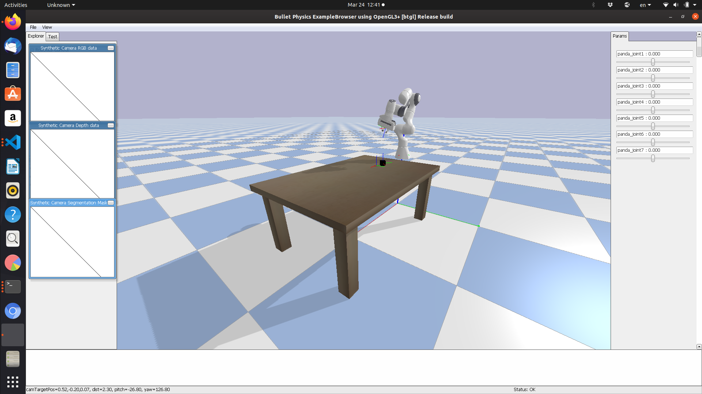
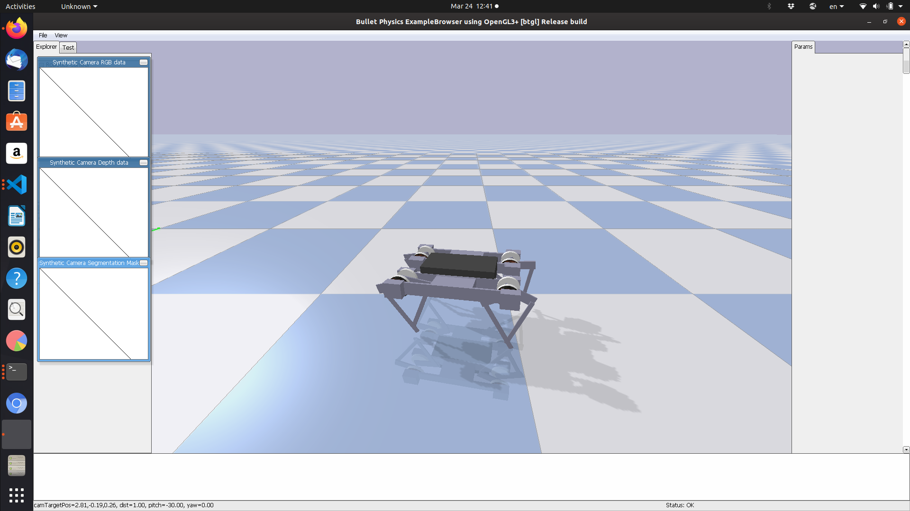

# shiro-corl-2021
Code associated with "Soft Hierarchical Reinforcement Learning for Robotics", a work to be submitted to CoRL 2021.

## Envs

### The Panda Environment



### The Minitaur Environment



## Docker

To install Docker with GPU support, do the following:

```sh
curl https://get.docker.com | sh \
  && sudo systemctl --now enable docker


# IMPORTANT: if you want to run docker as non-root, do the following:
sudo usermod -aG docker <your-user>

sudo apt-get update

sudo apt-get install -y nvidia-docker2

sudo systemctl restart docker

# testing gpu
sudo docker run --rm --gpus all nvidia/cuda:11.0-base nvidia-smi

```

### Docker Build

The standard docker run is:

```sh
docker build . -t <tag-name-here>

docker run --rm --gpus all -v <location of this repo on your computer>:/shiro-corl-2021 -t -i --user "$(id -u)" <tag-name-here> bash /shiro-corl-2021/run_container.sh

```

An example (this is what I used) is:

```sh
docker build . -t myimg

docker run --rm --gpus all -v /home/peasant98/Desktop/Robotics/shiro-corl-2021:/shiro-corl-2021 -t -i --user "$(id -u)" myimg bash /shiro-corl-2021/run_container.sh

```

### Using the Docker Hub

Check out the Docker Hub link [here](https://hub.docker.com/r/peasant98/shiro)!

```sh

docker pull peasant98/shiro:latest
docker run --rm --gpus all -v <location of this repo on your computer>:/shiro-corl-2021 -t -i --user "$(id -u)" peasant98/shiro:latest bash /shiro-corl-2021/run_container.sh

```

### Running with Singularity
To run with singularity (which can be done on the CU Boulder supercomputer):

```sh
ml singularity/3.6.4

# pull the docker image from the docker hub:
singularity pull docker://peasant98/shiro
```

Then, if you want to run a job on the supercomputer, specify that you want to run a job on the **GPU** cluster, and have

```sh
singularity exec --nv --bind /home/peasant98/Desktop/Robotics/shiro-corl-2021:/shiro-corl-2021 shiro.simg bash /shiro-corl-2021/run_container.sh
```

somewhere in your script.

## Installation 

There are two environments that you'll need to install: the Franka Panda robot
environment and the Minitaur environment. To do so, follow the below steps:
First, install [git-lfs](https://git-lfs.github.com/).

```sh
# installs the franka panda env
git clone https://github.com/robotology-playground/pybullet-robot-envs.git
cd pybullet-robot-envs

pip3 install -r requirements.txt
pip3 install -e .
```

To install the Minitaur env:

```sh
git clone https://github.com/bulletphysics/bullet3
cd bullet3
pip3 install .
```

To install the RL algorithms, clone our *forked* version of PFRL
[here](https://github.com/watakandai/pfrl). The steps to install are:

```sh
git clone https://github.com/watakandai/pfrl
cd pfrl
pip install .

```

Then, to install this package (`shiro`):

```sh
cd shiro-corl-2021
pip3 install .
```

## Supercomputer Installation

Compared to the traditional installation, the supercomputer installation
is significantly more involved. So, we have created an install script that should help you get up and running.

*Note*: Everything in simulation can only run headlessly. Also, if any issues
come up with the installation, please let me know! I might've gotten lucky in some areas.

1. Get an account on the CU Supercomputer System; you can
get it [here](https://curc.readthedocs.io/en/latest/access/logging-in.html).

2. You can ssh into your account as follows:

```sh
ssh <your-identikey-here>@login.rc.colorado.edu
```

Then, you'll need to finish the 2-factor authentication process.

3. `cd` into your `projects` directory; that is, do:

```sh
cd /projects/<your-identikey-here>
```

4. To clone and run:

```sh
git clone https://github.com/peasant98/shiro-corl-2021
./install.sh --identikey <your-identikey-here>

```

5. To run an example to ensure everything is working, end-to-end:

```sh
python3 shiro-corl-2021/shiro/examples/panda/train_panda_hiro.py
```

## Running Experiments

Training the Franka Panda:
```sh
python3 shiro-corl-2021/shiro/examples/panda/train_panda_hiro.py
```

Training the Minitaur:

TBD


## Contributing

Pull Requests are always welcome!